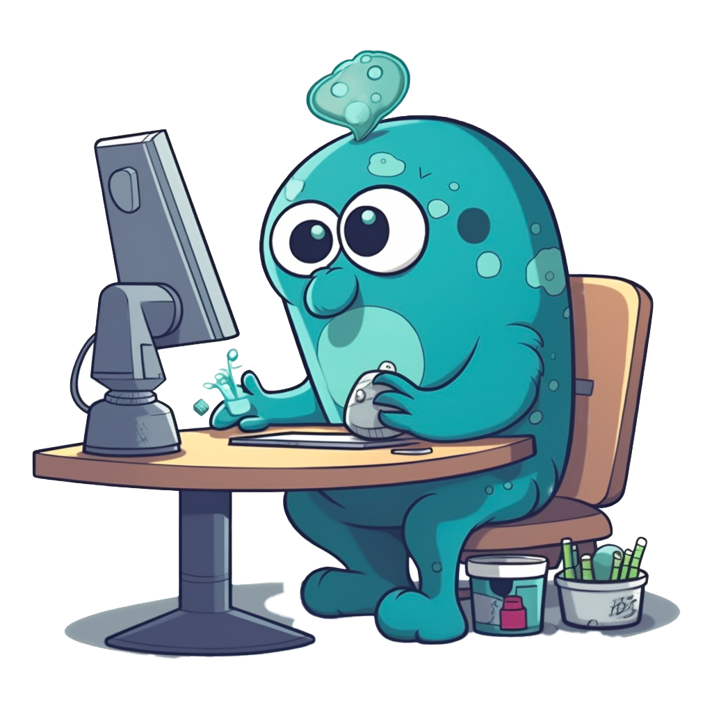

# Go and Microservices with gRPC

Chuck Sailer - July 15, 2023
<div align="center">
    
</div>

## Dependencies
For unit testing you will need:
| Package   | Purpose  |
| --------- | ---------
| [gomock](https://github.com/golang/mock) | For mocking services/apis
| [stretchr/assert](github.com/stretchr/testify/assert) | For adding asserts |

> If you wish to generate/re-generate the ```mocks``` and you're using Mac OS, you will need ```go-mockgen```. Follow these instructions: [Install go-mockgen](https://ports.macports.org/port/go-mockgen/)∏